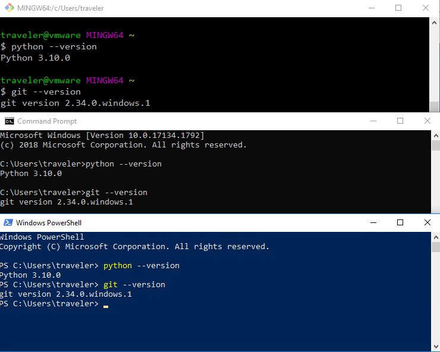
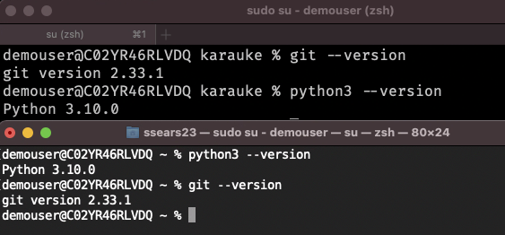

<!-- markdownlint-disable MD013 MD033 -->
<!-- vim: set tw=100 :-->
# Git installation on various platforms

Before you can do anything with git itself (rather than in the github web interface) you'll need it
installed.

You may also need a working terminal client and text editor, so they're covered here also.

## Git installation per platform

### Windows

For Windows, which is more complicated than most, you can follow the step-by-step instructions in
[Installing Git on Windows](git-on-windows.md)

Alterntively, on modern windows you could install the Windows Subsystem for Linux (WSL)

### Mac

For Mac, the best way to install it appears to use homebrew - you'll need to use a terminal for
that.

You can get Homebrew from the [Homebrew website](https://brew.sh/) - instructions are there

Once all that is done, in a terminal window, run

    brew install git

### Linux, or WSL (Windows Subsystem for Linux)

On Linux systems (yeah, I know this is just me), it'll probably be either

    apt install git

Or

    dnf install git

or an equivalent for your distribution of choice, if you have one, you probably already know how to
do this.

This should also work for the Windows Subsystem for Linux, if you've got your geek on.

## Terminal emulators

Git on windows comes with a terminal called "Git Bash" which works just fine.
It should work fine in either the built-in command prompt or powershell also.

On Mac, the default Terminal app works ok, but [iterm2](https://iterm2.com/) is much much better.

Anyway, to make sure all is well, you'll need to open a terminal on your OS of choice and type this:

    git --version

And it should look like the 'git' line in one of these:

On a Mac, open either iterm or terminal and do the same thing, here's the Mac version:

